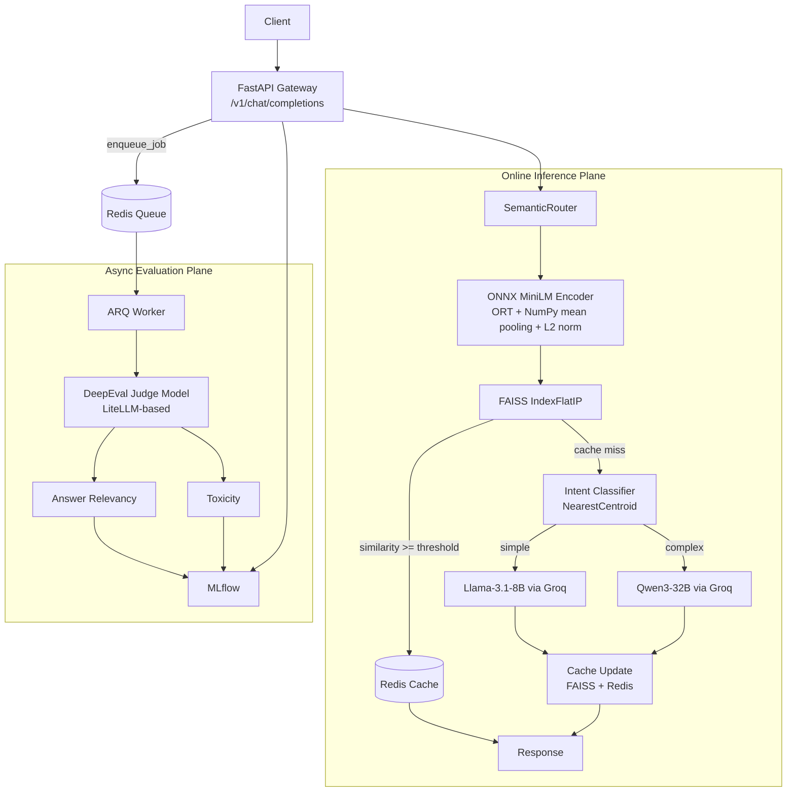
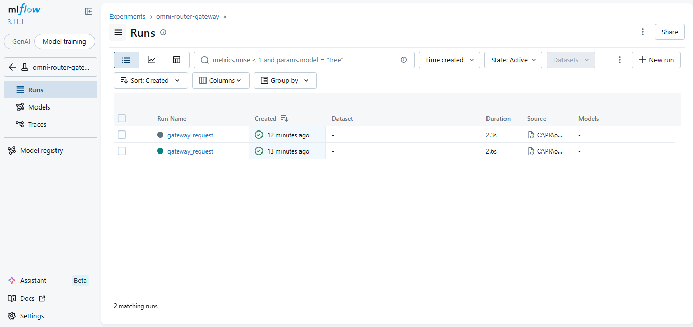
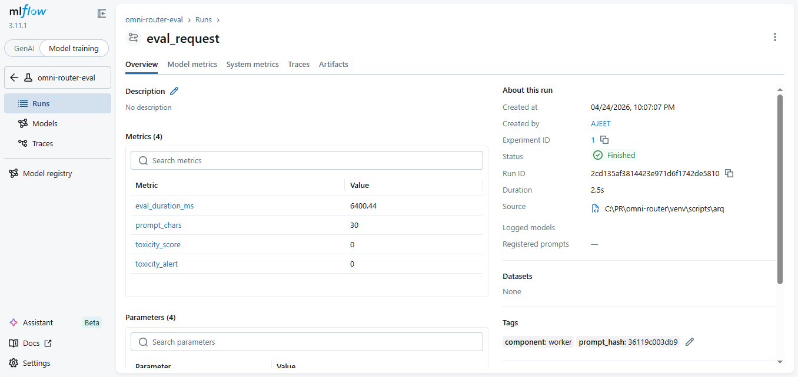

# Omni-Router

Omni-Router is a production-style LLM gateway that combines semantic caching, intent-based model routing, asynchronous quality evaluation, and experiment observability.  
It is designed to minimize latency and cost for "simple" requests while preserving quality for "complex" requests.

## Recruiter Snapshot

- Built an end-to-end AI routing system from model training to online inference.
- Optimized embedding throughput using ONNX Runtime + NumPy pooling (CPU-first deployment path).
- Designed two-tier routing: semantic cache first, then learned intent classifier for model selection.
- Implemented asynchronous evaluation pipeline with ARQ + DeepEval to avoid request-path blocking.
- Integrated MLflow for request and evaluation telemetry to support iterative quality tuning.

## Production Architecture





## Why It Is Fast

### 1) ONNX embeddings on CPU

- `src/semantic_router.py` runs `ORTModelForFeatureExtraction` with explicit session thread settings.
- Embedding post-processing uses pure NumPy mean pooling and normalization.
- Result: fast local vectorization without full PyTorch runtime overhead on every request.

### 2) Semantic cache before LLM call

- Every request is embedded and searched in FAISS (`IndexFlatIP`).
- High-similarity queries are served directly from Redis (cache hit path).
- This avoids repeated LLM inference for semantically similar prompts.

### 3) Cheap model for simple requests, stronger model for complex requests

- Cache misses are classified as `simple` or `complex`.
- `simple` routes to Llama; `complex` routes to Qwen.
- This keeps the average latency/cost profile low while preserving capability where needed.

## Training Journey: Model Comparison and Selection

Training workflow lives in `trained_model/binary_intent_classification.ipynb` and follows:

1. Build binary labels (`simple`, `complex`) and encode with `LabelEncoder`.
2. Generate sentence embeddings with `all-MiniLM-L6-v2`.
3. Compare multiple classifier families:
   - linear models (Logistic Regression, SVM)
   - tree/boosting models (Random Forest, XGBoost)
   - neural networks (multiple deep architectures)
   - distance-based baselines (KNN, NearestCentroid)
4. Run grid-search based tuning for selected models.
5. Persist the final classifier and label encoder using `joblib`.

Notebook evidence includes:

- 2-class setup with mapping: `complex -> 0`, `simple -> 1`.
- Multiple neural network experiments and traditional ML baselines.
- Tuned NearestCentroid section with best params:
  - `metric='euclidean'`
  - `shrink_threshold=None`
- Serialized artifacts:
  - `intent_classification_model.pkl`
  - `intent_label_encoder.pkl`

### Why NearestCentroid in serving path

While several models perform competitively offline, NearestCentroid was selected as the production classifier for this gateway because it is:

- extremely lightweight at inference,
- stable with embedding-space separation,
- easy to debug/explain for routing behavior,
- operationally simple for low-latency online decisions.

This is a production tradeoff: maximize serving efficiency and robustness for binary routing, while deferring heavy reasoning to Qwen only when needed.

## ARQ and DeepEval: How Evaluation Affects the Router

### ARQ background execution

- `src/gateway.py` enqueues `run_evaluation` jobs after the response is returned.
- Evaluation never blocks user-facing latency.

### Worker-side DeepEval

- `src/worker.py` runs:
  - `AnswerRelevancyMetric`
  - `ToxicityMetric`
- Metrics are executed independently with failure isolation, so one metric failure does not kill the entire evaluation job.

### Impact on routing decisions

Current behavior:

- Evaluation is asynchronous observability and quality monitoring.
- Router decisions are still made by cache similarity + NearestCentroid intent classification.

Operational implication:

- DeepEval signals are used to monitor model quality, detect safety regressions, and drive retraining/policy updates.
- This supports a closed-loop improvement process without adding latency to online inference.



## MLflow: Why It Matters Here

MLflow turns this from a demo router into an auditable optimization system.

- Gateway experiment logs:
  - model used
  - route taken
  - request latency
  - prompt size
- Worker experiment logs:
  - relevancy score
  - toxicity score
  - evaluation duration
  - judge model and status tags

Practical value:

- Compare latency/cost/quality across model-routing strategies.
- Spot drift in evaluation quality over time.
- Support release decisions with measurable evidence instead of intuition.

## Tech Stack

- API: FastAPI
- Routing Runtime: Python
- Embeddings: Hugging Face MiniLM exported to ONNX Runtime
- Vector Search: FAISS
- Cache + Queue: Redis
- LLM Serving: LiteLLM + Groq models
- Async Jobs: ARQ
- Quality Evaluation: DeepEval
- Observability: MLflow

## Setup

### Prerequisites

- Python 3.10+
- Redis
- Groq API key

### Environment Variables

Create `.env`:

```env
REDIS_URI=redis://localhost:6379
GROQ_API_KEY=your-groq-api-key
MLFLOW_TRACKING_URI=http://localhost:5000
MLFLOW_EXPERIMENT_GATEWAY=omni-router-gateway
MLFLOW_EXPERIMENT_EVAL=omni-router-eval
DEEPEVAL_JUDGE_MODEL=groq/llama-3.1-8b-instant
```

### Run Services

1) MLflow tracking server

```bash
mlflow server --host 0.0.0.0 --port 5000 --backend-store-uri sqlite:///mlflow.db --default-artifact-root ./mlruns
```

2) Gateway

```bash
uvicorn src.gateway:app --reload --port 8002
```

3) Worker

```bash
arq src.worker.WorkerSettings
```

MLflow UI: `http://localhost:5000`

## Example Response

```json
{
  "status": "success",
  "gateway_metrics": {
    "model_used": "Qwen-3-32B",
    "latency_ms": 450.2,
    "route_taken": "llm route"
  },
  "message": "Here is the architectural breakdown you requested..."
}
```
